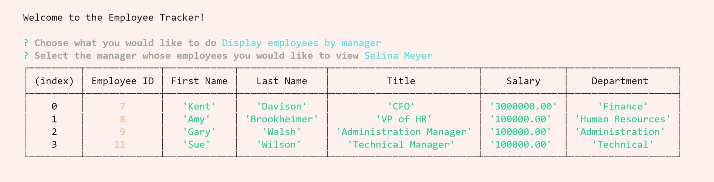

# Employee Management System

A command-line **content management system** application that manages a company's employee database using Node.js, Inquirer, and MySQL.


[TOC]


## User Story

```md
AS A business owner
I WANT to be able to view and manage the departments, roles, and employees in my company
SO THAT I can organize and plan my business
```

## Instructions

Create a database schema containing three tables to organize by employee, department, & role (job title), as pictured.


## Installation

Enter the terminal and enter **"npm install"** to install all required dependencies needed to execute this application. The following packages must be installed: **Inquirer & MySQL2.** Next, type **"node index.js"** & enter in the terminal to start the app. 

## Project Description & Basic Structure

In this application, the user is able to manipulate data (specifically view, add, update, & remove data) in a SQL database, specifically three databases:

1. Employees - *contains a "title" that is a member of the "roles" database*
2. Roles - *each role is associated with a member of the "departments" database*
3. Departments

The user is first presented with the following options:


### View

- The user can select View Employees, Roles, or Departments and a table will be displayed in the terminal displaying detailed user-inputted information from the chosen database, as pictured below:


- Selecting "Display employees by manager" will prompt you to choose a manager. Then, a list is generated showing all of the employees that report to the selected individual. Below, the CEO Selina Meyer was selected and all of her employees are presented.




- By selecting "View utilized budget for a department," the user can select a department and the app will sum up the salaries of all the individuals who work in that department.


### Add

- The user can select to add a new employee, a new department, or a new role. This will prompt the user to fill in details which will then be added to the corresponding database.


### Update

- By selecting "Update manager," the user can change the manager of an existing employee to another employee in the database.

  

### Remove

- The user can remove an employee from the database by selecting "Delete an employee."

- The user can also remove a role from the "roles" database by selecting "Delete a role". This will cause any employees who had that role to display "null" in role-specific fields the next time "View Employees" is executed.
- Finally, the user can remove a department from the database by selecting "Delete a department."


## Walkthrough Video

See the application in action 

[here]: https://vimeo.com/595110754

